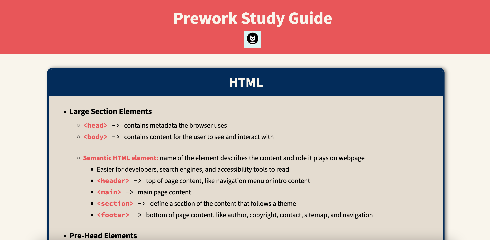

# Prework Study Guide

## Description

This website was created to refresh on the basics of **HTML, CSS, JavaScript, and Git**. The Prework Study Guide helps new bootcamp students study web development topics like HTML, CSS, Git, and JavaScript. For students who don't know where to start, the console prints out a random subject for them to study. Through this project, I mainly learned how to develop a project properly using GitHub.  

## Installation

N/A

## Usage

You can open the [live website here.](jacob-medina.github.io/prework-study-guide/)  

To use the Prework Study Guide, you can review the labeled sections on the live site, including the following topics:
- HTML
- CSS
- JavaScript
- Git

To see a full list of the topics and a random topic to study, you can use the **console on Chrome DevTools**.  
To access Chrome DevTools, press `Command+Option+I` (macOS) or `Control+Shift+I` (Windows). Then press the `Console` tab at the top.

## Credits

N/A

## License

Please refer to the LICENSE in the repo.
